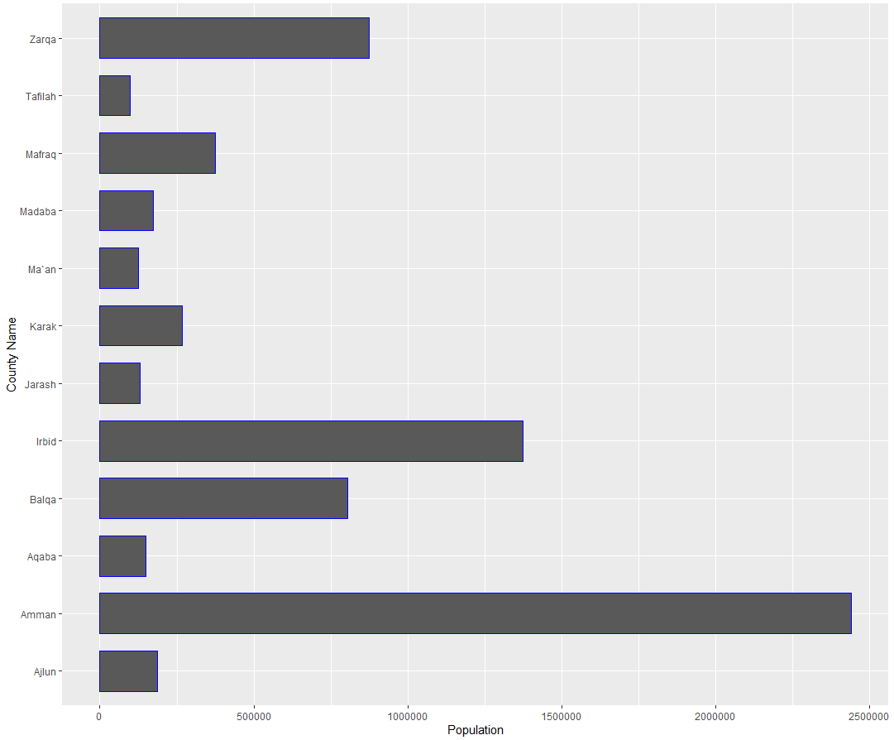
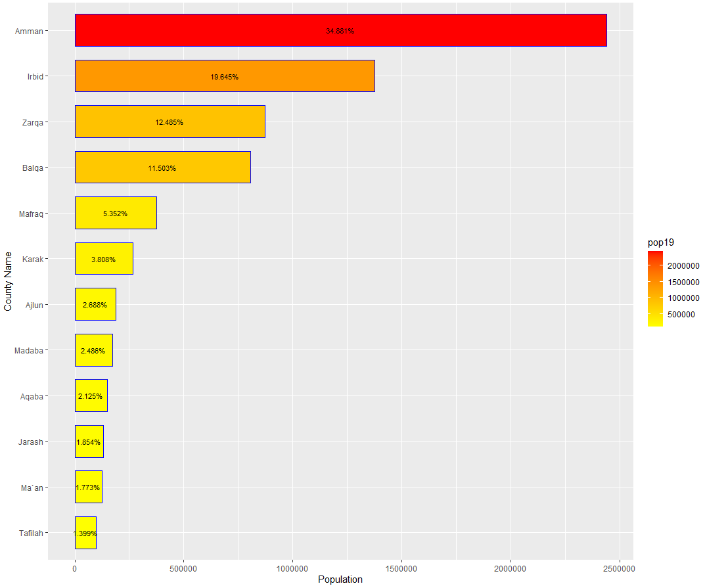
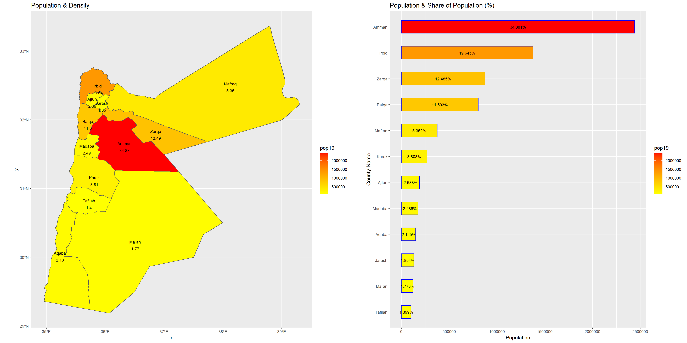

## Starting

At this point I'm adding population data into my country. But I found that Zambia was too big a country to do this for as it had 161 million gridcells. So I switched countries to Jordan and created this initial plot of population density.

## ADM 1

After that I extracted the populatiton count data then implemented that into my plot to show the different densities of different counties within Jordan to provide this plot. 

## ADM 2 (Stretch Goal 1 & 2)
Same thing as before but with adm 2.

Refining the plot

## 3D Model

Pictures of the 3D model at different angles

## Barplot

Here I'm combining the barplot with the map, placing them side by side.

Here is an ADM 2 barplot

