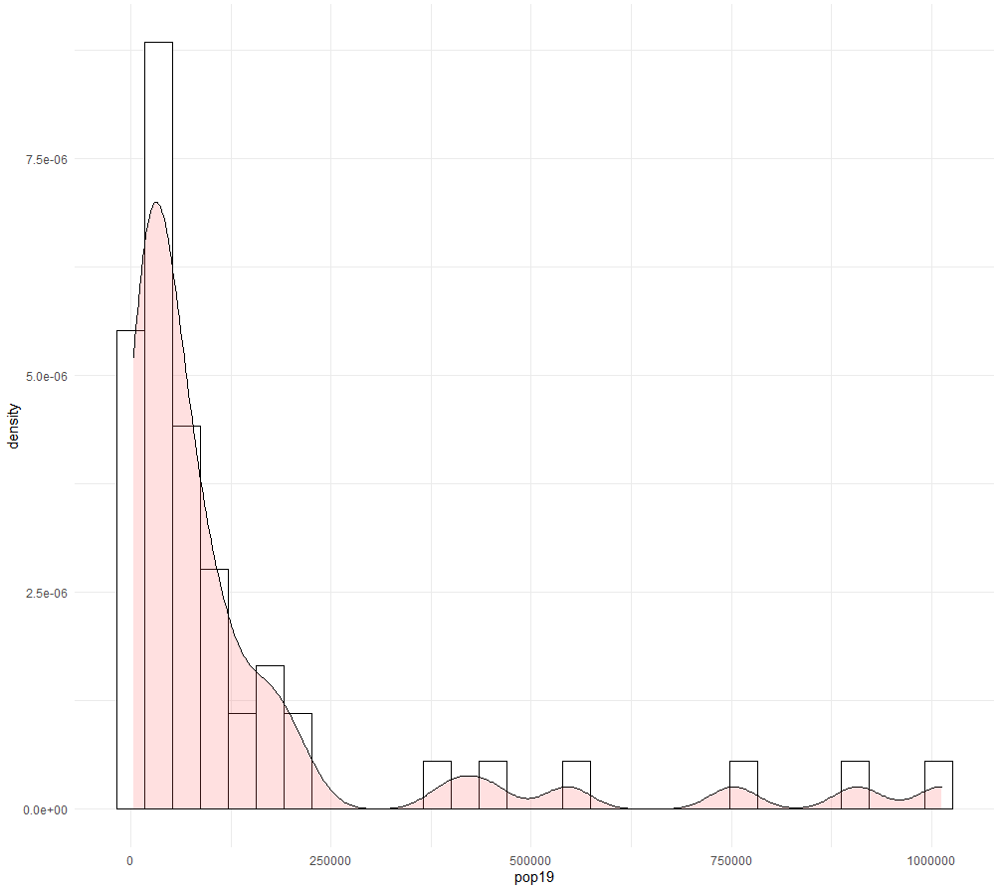

Now Here I am attempting to compare the population and the density within Jordan.

After that I want to compare the density to a different variable so i chose the sum of the night time lights. 

Here I'm plotting the population against the sum of night time lights

I then check the R squared value and got a 0.5487 which means they aren't strongly correlated. Another point is that the sum of ntl is actually individually the most correlated to the population as all other values have a smaller R squared value for Jordan. 

Here the highest R squared value I got while plotting was when I plotted the population against the sum of everything. 

This yieleded a higher R squared value than all the means.

