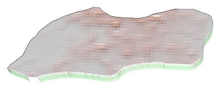
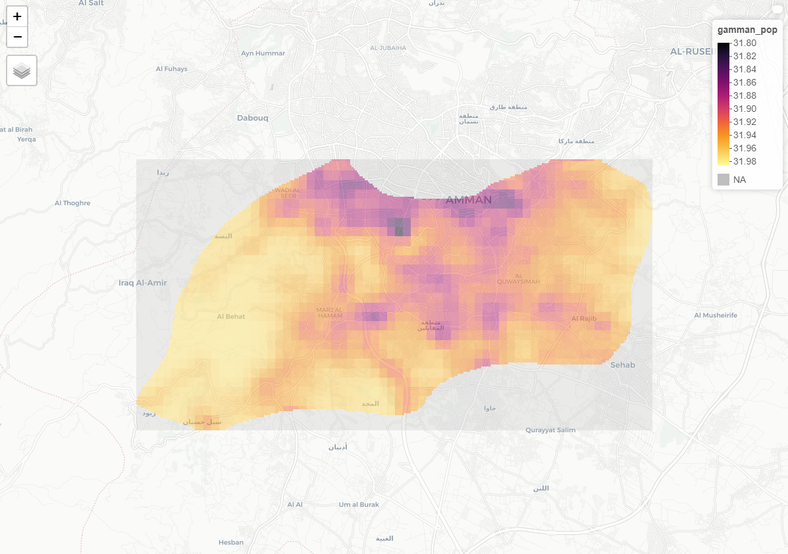
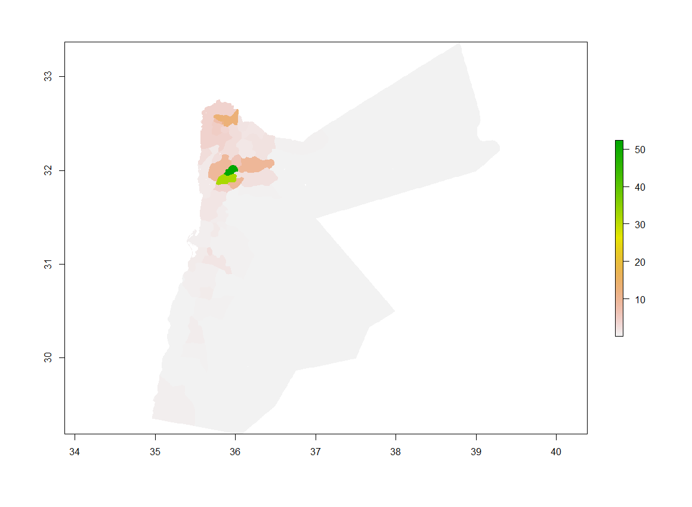

## Amman. Capital city of Jordan

Here I'm getting models for the capital city of Jordan which is Amman. 

## Jordan as a whole
**MEAN**

**SUM**

**LOG**

As a whole I think the best predictor still is the mean, as it gives the lowest differences. 

