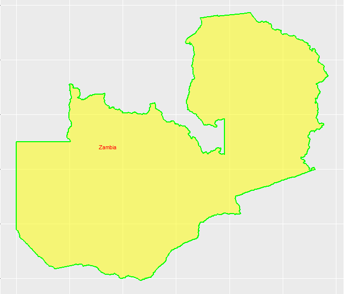
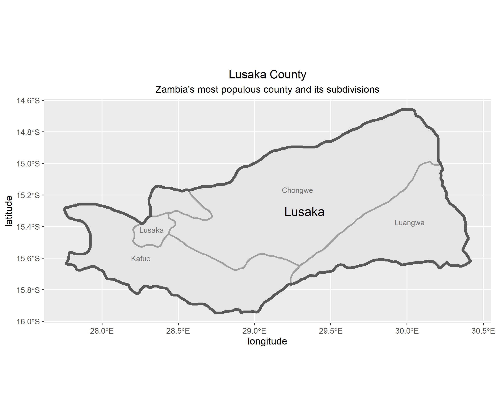
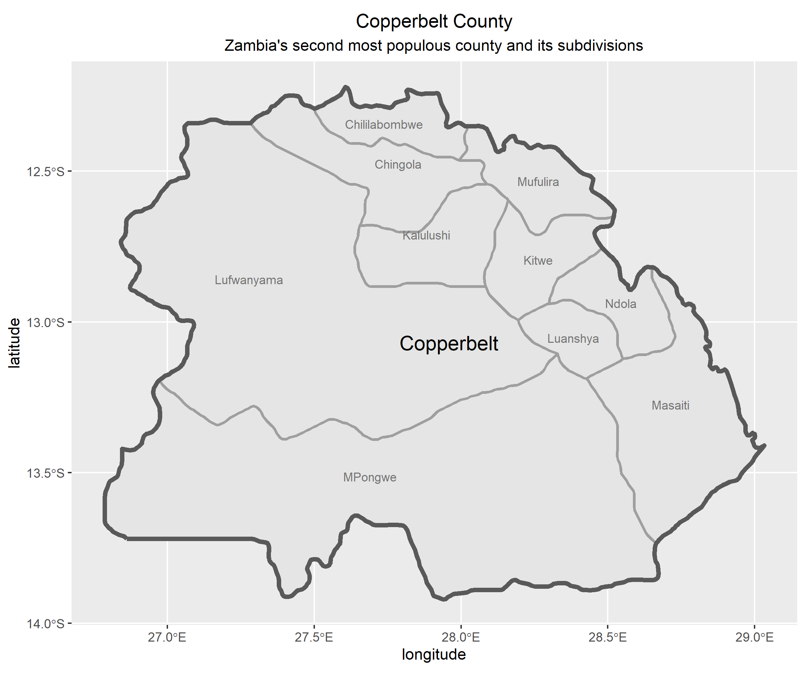
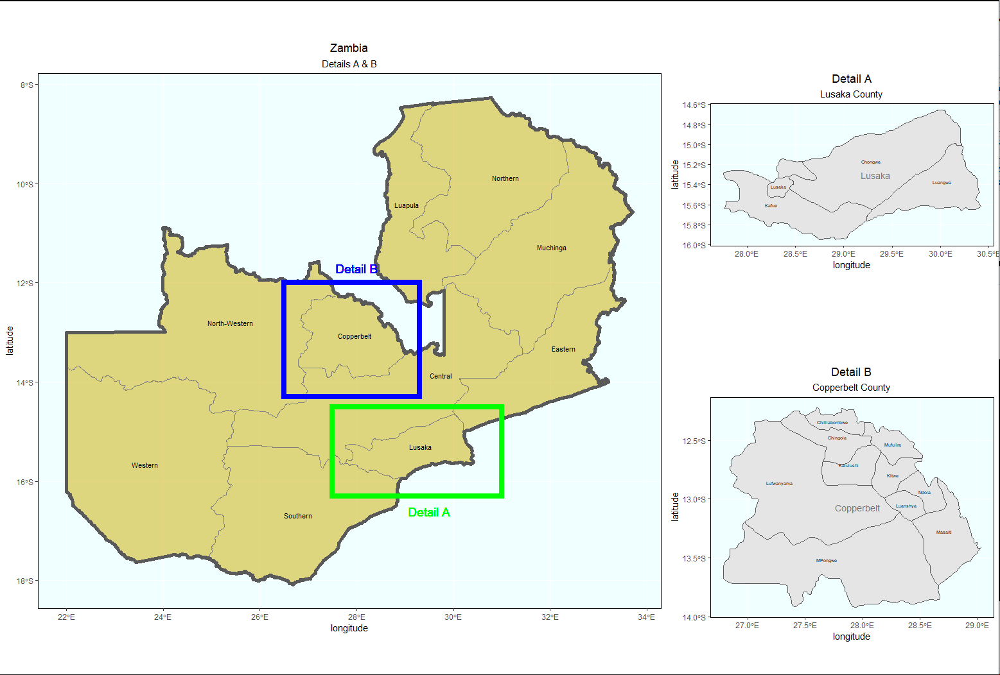

## First level of country imaging

Here the image only shows the country name and has not yet divided the country up to its states

## Administrative Subdivisions of Zambia imaging

At this point the country has been divided up into counties. The image shows the result.

## Individual Strethch Goal 2
Now that the country has already been divided up into its counties, I searched up the two most populated counties within zambia and made images of them. 

## Individual Stretch Goal 3
For this stretch goal I had to adjust the coordinates to make sure it shows up on my plot. Also there were, two packages that previously weren't installed that needed to be added. These were devtools and ggdflabel. 

