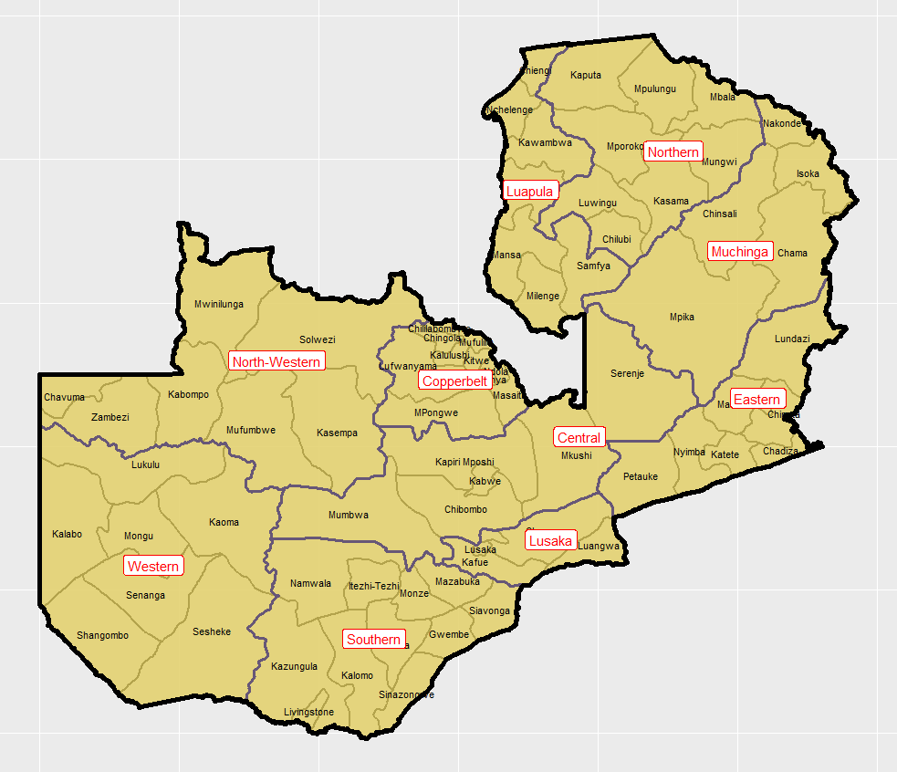

## First level of country imaging

Here the image only shows the country name and has not yet divided the country up to its states

## Administrative Subdivisions of Zambia imaging

At this point the country has been divided up into states. For future reference I probably should play around more with getting better designs with the color selection, text sizing, etc.
